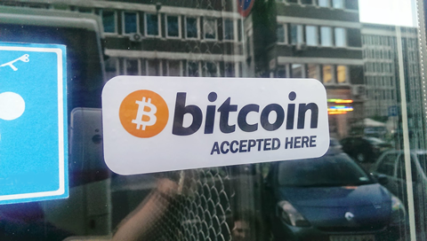

# btcPays.me

<b>What is the btcPOS?:</b>

It's the ideal web based point-of-sale (POS) solution for restaurants, bars, cafés, and all retail merchants accepting Bitcoin. btcPOS can easily give merchants the ability to accept bitcoin payments in store fronts.

Our goal is to bring the web service of crypto-currencies into the 'real world' in every way possible, without the merchant requiring a specialized POS or or register for accepting payments. We want nothing less than for every merchant, storefront, vending machine, parking garage, subway turnstile, taxicab, and whatever-else-can-be-imagined, to accept payments with crypto-currencies.

Just set up an account on btcPOS with your bitcoin wallet address and your business can start receiving Bitcoin payments.

(advertise your BTC acceptance and bring new customers in!)

        

This is an effort of Geopay.me marketplace merchant tools.

        
        
        </img>

