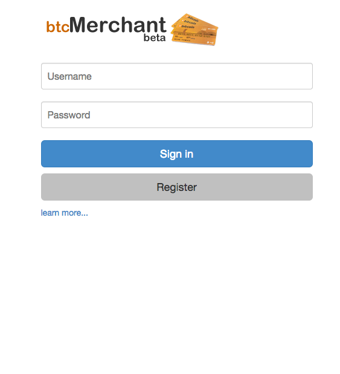
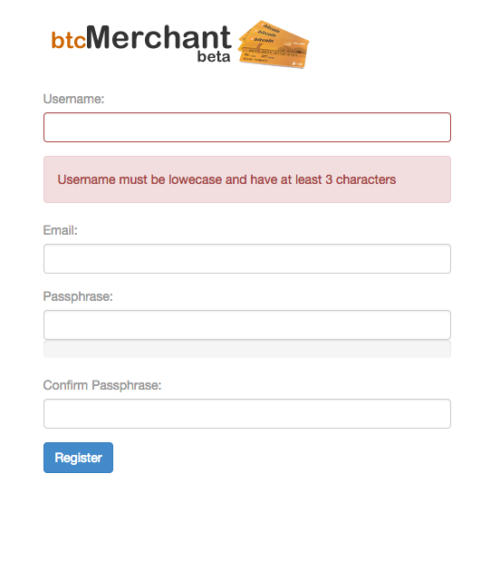

# btcPays.me
A web BTC based Point of Sale for anyone accepting bitcoins

<b>Description</b>

It's the ideal web based point-of-sale (POS) solution for restaurants, bars, cafés, and all retail merchants accepting Bitcoin.
Just set up an account on btcPOS with your bitcoin wallet address and your business can start receiving Bitcoin payments.

Other accept Bitcoin for you store and convert that bitcoin to receive cash by selling your coin back to your customers. (advertise and bring new customers in!)

This is an effort of Geopay.me marketplace merchant tools.

        
        
        </img>

